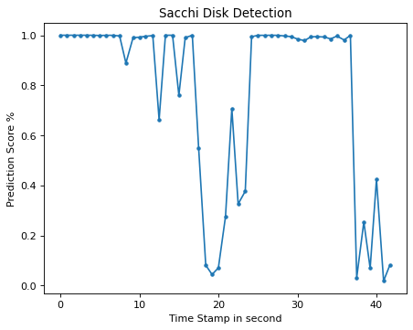

# Objective

This is trained model to identify a secchi disk from a given video. This model 
is built on Tensorflow 2.0 using python version 3.6.9.

This program takes a video im MP4 or AVI format as in input and detects secchi disc.
It generates an image file 'secchi.png' to mark image detection frame by frame. 

## Prerequisite

python 3.6.9

## Installation

### Create Virtual Environment ENV3

```

python -m venv ENV3

```

In case of multiple version of python, use command 

```

py -3.6 -m venv ENV3

```

This command will create a new ENV3 environment using python 3.6 version.


### Installation of cloudmesh-secchi

Start from home directory. Activate python virtual environment before installation. 
Command to activate

For Windows:

```

ENV3/Scripts/activate.bat

```

For Linux:

```

source ENV3/bin/activate

```

Create a cm folder 

```

mkdir cm
cd cm

```

Run these commands to install cloudmesh-seechi

```
pip install cloudmesh-cmd5
pip install cloudmesh-sys
git clone https://github.com/cloudmesh/cloudmesh-secchi.git
cd cloudmesh-secchi
pip install -e .

```

Once installation is complete, run help command to check if installation is successful.

```
cms secchi help

```

## Command Line Execution

### Commands To Run Prediction

#### Upload and delete video file through cms command. Max file size is 500MB.

This is the file on which prediction would run.

For upload, run command

```
cms secchi upload '~/Desktop/file.mp4' --predict
```

For delete, run command 

```
cms secchi remove --predict
```

#### Run predict through cms command

```
cms secchi run --predict
```

To resize image frame, use [--resize] option.

```
cms secchi run --predict --resize=0.5
```

To quit video, press 'q'

#### Get the graph output

```
cms secchi show graph
```

This graph is saved under root folder as 'secchi.png'.


#### Predict Screen and Graph

Example of prediction video and graph is shown:

 

