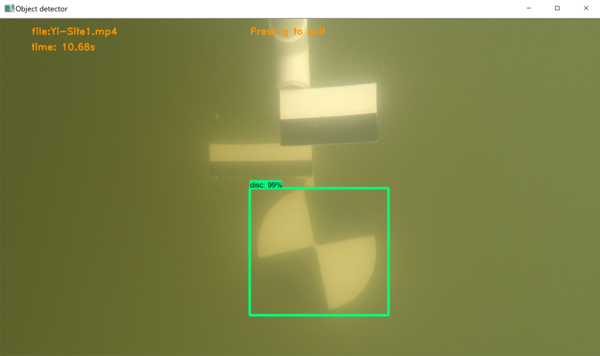
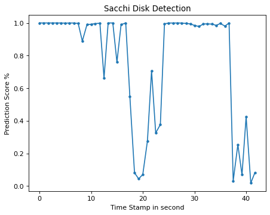

# cloudmesh-secchi


[](https://pypi.org/project/cloudmesh-common/)
[](https://pypi.python.org/pypi/cloudmesh-common)
[](https://github.com/cloudmesh/cloudmesh-common/blob/main/LICENSE)
[](https://pypi.python.org/pypi/cloudmesh-common)
[](https://pypi.python.org/pypi/cloudmesh-common)
[](https://travis-ci.com/cloudmesh/cloudmesh-common)


The measurement of turbidity is a key test of water quality. As part of a scientific experiment the 
turbidity of lakes, in and around Indianapolis, is measured by suspending a 
Secchi disc in water and get the reading from the measuring tape of the depth
where disc almost disappears in water.  The activity of suspending the disc in water and lower it 
until it disappears is  captured in video format. This video is the input of this program.
This program takes a video im MP4 or AVI format as in input and detects secchi disc.
It generates an image file 'secchi.png' to mark image detection frame by frame. 

This is trained model is then used to identify a Secchi disk from a given video taken as part of repeated 
scientific experiments. 

From a number of training videos we identify in which frame the Secchi disk is still visible.




**Fig 1**: Predictor Output Image


## Prerequisits

* Python 3.7.7, 3.9
* Tensorflow 2.0.0b1 - CPU version : This is included as a dependencies in 
  cloudmesh-secchi and gets installed itself when cloudmesh-secchi is installed. 
  No seperate installation is required. 

This program depends on and tensorflow 2.0 and Python 3.8  or whatever version of Python tensorflow is supported on. 
It was last tested with Python version 3.7.7. The up to date instructions for various operating systems are provided at 

* <https://www.tensorflow.org/install>

Here we give for some operating systems a quickstart that works for us. We use a Python venv to assure we 
do not interfere with other Python versions.


### Ubuntu 20.04

```
sudo apt-get install python3-dev  -y
python3.8 -m venv ~/ENV38
source ~/ENV38/bin/activate
pip install --upgrade pip
pip install -r requirements.txt
```

## cms secchi command

The manual page of the command can be invoked from the cloudmesh shell with 

```
cms secci help
```

You will see the following manual page


```
Usage:
  secchi upload [FILE] [--training] [--validate] [--predict][--setfilelimit=100]
  secchi run [--setup] [--predict] [--training][--resize=0.5]
  secchi remove [VIDEO][--training][--validate][--predict]
  secchi show graph 
  secchi list file [--predict] [--training]
  secchi create partitiondataset [INPUTDIR] [--ratio=0.2]
  secchi delete partitiondataset
  secchi prep [--training]
  secchi set [--predict] [--filesize=100]

```

* [--training][--validate] and partitiondataset options are next phase implementation
  and are not implemented in this version.
* To train new model, instructions are provided in 'Project-Details.md'.


## Installation

### Create Virtual Environment ENV3

```
python -m venv ENV3
```

In case of multiple version of python, use command 

```
py -3.7 -m venv ENV3
```

This command will create a new ENV3 environment using python 3.7 version.


### Installation of cloudmesh-secchi

Start from home directory. Activate python virtual environment before installation. 
Command to activate

For Windows:

```
ENV3/Scripts/activate.bat
```

For Linux:

```
source ENV3/bin/activate
```

Create a cm folder 

```
mkdir cm
cd cm
```

Run these commands to install cloudmesh-seechi

```
pip install cloudmesh-cmd5
pip install cloudmesh-sys
git clone https://github.com/cloudmesh/cloudmesh-secchi.git
cd cloudmesh-secchi
pip install -e .

```

Installation of cloudmesh-secchi takes care of installation of all dependencies including
tensorflow 2.0. No seperate installation of tensorflow is required.

Once installation is complete, run help command to check if installation is successful.

```
cms secchi help
```

## Command Line Execution

The prediction and training can be controlled with a simple command line tools

### Commands To Run Prediction

We have developed a number of commands that simplify the prediction process.

#### Upload and delete video file through cms command. Max file size is 500MB.

This is the file on which prediction would run.

* For upload, run command

```
cms secchi upload '~/Desktop/file.mp4' --predict
```

This command fails if filesize of video is more than 500MB. 
If fails, [--setfilelimit=800] can be used to increase file size limit(in MB) and upload
video.

```
# To increase file size limit to 800MB
cms secchi upload '~/Desktop/file.mp4' --predict --setfilelimit=800

``` 

* For delete, run command 

```
cms secchi remove --predict
```

  Or we can sepcify specific file to be removed.

```
cms secchi remove 'filename.mp4' --predict
```  

#### Run predict through cms command

```
cms secchi run --predict
```

To resize image frame, use [--resize] option.

```
cms secchi run --predict --resize=0.5
```

To quit video, press 'q'

#### Get the graph output

```
cms secchi show graph
```

This graph is saved under root folder as 'secchi.png'.


#### Predict Screen and Graph

Example of prediction video and graph is shown in Fig. 1. The reason for the image disappearing in the middle is 
that it drifted out of the view of the camera.

 

**Fig 2**: Detection Probability to identify the Secchi imaage (1.0 is 100%)


References:

* [Tensorflow Object Detection Model](https://github.com/tensorflow/models/tree/master/research/object_detection)
* [Training Custom Object Detector](https://tensorflow-object-detection-api-tutorial.readthedocs.io/en/latest/training.html)
* [OpenCV- Getting Started With Video](https://opencv-python-tutroals.readthedocs.io/en/latest/py_tutorials/py_gui/py_video_display/py_video_display.html)
