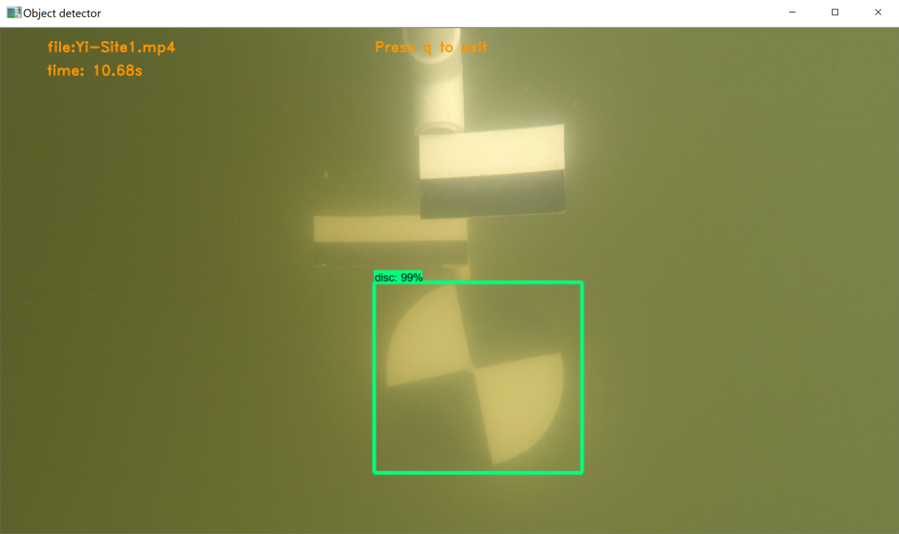

# Objective

The measurement of turbidity is a key test of water quality. In this study, 
turbidity of lakes, in and around Indianapolis, is measured by suspending a 
secchi disc in water and get the reading from the measuring tape of the depth
where disc almost disappears in water. 

The activity of suspending the disc in water and lower it until it disappears is
captured in video format. This video format is the input of this program.

This is trained model to identify a secchi disk from a given video. This model 
is built on Tensorflow 2.0 using python version 3.7.7.

This program takes a video im MP4 or AVI format as in input and detects secchi disc.
It generates an image file 'secchi.png' to mark image detection frame by frame. 

Usage:

```
Usage:
                secchi upload [FILE] [--training] [--validate] [--predict][--setfilelimit=100]
                secchi run [--setup] [--predict] [--training][--resize=0.5]
                secchi remove [VIDEO][--training][--validate][--predict]
                secchi show graph 
                secchi list file [--predict] [--training]
                secchi create partitiondataset [INPUTDIR] [--ratio=0.2]
                secchi delete partitiondataset
                secchi prep [--training]
                secchi set [--predict] [--filesize=100]

```

* [--training][--validate] and partitiondataset options are next phase implementation
  and are not implemented in this version.
* To train new model, instructions are provided in 'Project-Details.md'.

## Prerequisite

* Python 3.7.7
* Tensorflow 2.0.0b1 - CPU version : This is included as a dependencies in 
  cloudmesh-secchi and gets installed itself when cloudmesh-secchi is installed. 
  No seperate installation is required. 

## Installation

### Create Virtual Environment ENV3

```
python -m venv ENV3
```

In case of multiple version of python, use command 

```
py -3.7 -m venv ENV3
```

This command will create a new ENV3 environment using python 3.7 version.


### Installation of cloudmesh-secchi

Start from home directory. Activate python virtual environment before installation. 
Command to activate

For Windows:

```
ENV3/Scripts/activate.bat
```

For Linux:

```
source ENV3/bin/activate
```

Create a cm folder 

```
mkdir cm
cd cm
```

Run these commands to install cloudmesh-seechi

```
pip install cloudmesh-cmd5
pip install cloudmesh-sys
git clone https://github.com/cloudmesh/cloudmesh-secchi.git
cd cloudmesh-secchi
pip install -e .

```

Installation of cloudmesh-secchi takes care of installation of all dependencies including
tensorflow 2.0. No seperate installation of tensorflow is required.

Once installation is complete, run help command to check if installation is successful.

```
cms secchi help
```

## Command Line Execution

### Commands To Run Prediction

#### Upload and delete video file through cms command. Max file size is 500MB.

This is the file on which prediction would run.

* For upload, run command

```
cms secchi upload '~/Desktop/file.mp4' --predict
```

This command fails if filesize of video is more than 500MB. 
If fails, [--setfilelimit=800] can be used to increase file size limit(in MB) and upload
video.

```
# To increase file size limit to 800MB
cms secchi upload '~/Desktop/file.mp4' --predict --setfilelimit=800

``` 

* For delete, run command 

```
cms secchi remove --predict
```

  Or we can sepcify specific file to be removed.

```
cms secchi remove 'filename.mp4' --predict
```  

#### Run predict through cms command

```
cms secchi run --predict
```

To resize image frame, use [--resize] option.

```
cms secchi run --predict --resize=0.5
```

To quit video, press 'q'

#### Get the graph output

```
cms secchi show graph
```

This graph is saved under root folder as 'secchi.png'.


#### Predict Screen and Graph

Example of prediction video and graph is shown:

 



References:

* [Tensorflow Object Detection Model](https://github.com/tensorflow/models/tree/master/research/object_detection)
* [Training Custom Object Detector](https://tensorflow-object-detection-api-tutorial.readthedocs.io/en/latest/training.html)
* [OpenCV- Getting Started With Video](https://opencv-python-tutroals.readthedocs.io/en/latest/py_tutorials/py_gui/py_video_display/py_video_display.html)
