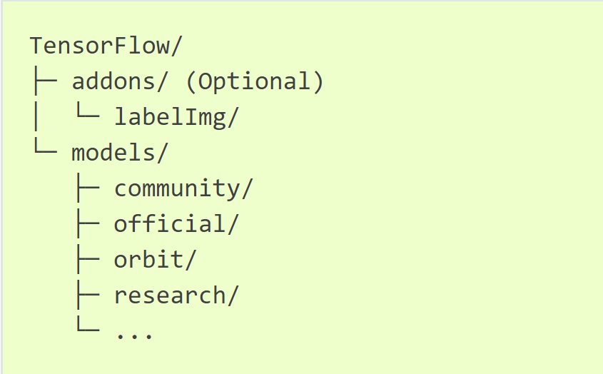
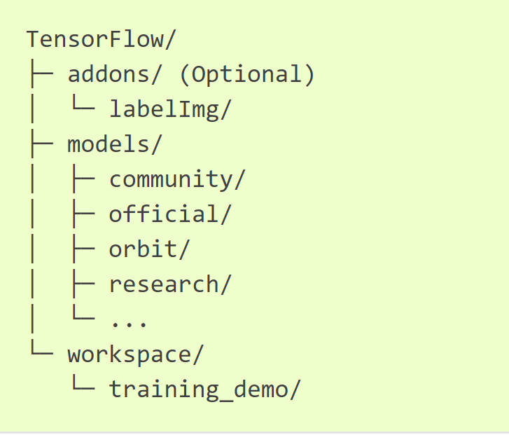

# This is instruction file for training.
## Step 1 - Install TensorFlow 
Install TensorFlow by following steps in [link](https://tensorflow-object-detection-api-tutorial.readthedocs.io/en/latest/install.html#tf-install)
## Step 2 - Install TensorFlow Object Detection API 
Install TensorFlow Object Detection API by following steps in [link](https://tensorflow-object-detection-api-tutorial.readthedocs.io/en/latest/install.html#tf-models-install)
Installation will have directory tensorFlow created.



## Step 3 - Download zip
Download zip file 'TensorFlow_Backup.zip' places in google drive [link](https://drive.google.com/file/d/1QRT8m9arFrrrjhjTgrgoL0iYHe32Ypdt/view?usp=sharing). This file has restriced access and access is shared with Professor. File size is ~ 5GB.
## Step 4 - Setup training directory
Unzip TensorFlow_Backup, copy 'scripts' and 'workspace' folder under 'TensorFlow_Backup' and paste into Tensorflow directory created in step 2. 



## Step 5 - Pre-trained model is already downloaded under 'training_demo/pre-trained-models'
No action needed here

## Step 6 - Training the model
cd into training/demo folder and run command to train model
```
python model_main.py --model_dir=pre-trained-model/ --pipeline_config_path=training/pipeline.config
```
This should start training.
